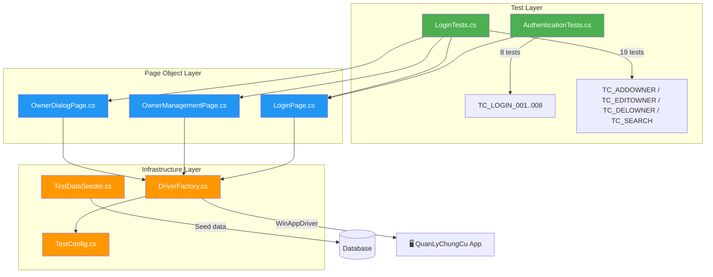

<div align="center">

# 🏢 Kiểm Thử Tự Động - Ứng Dụng Quản Lý Chung Cư

[](https://dotnet.microsoft.com/)
[](https://github.com/microsoft/WinAppDriver)
[](https://docs.microsoft.com/visualstudio/test/)
[](#)
[](LICENSE)

**Hệ thống kiểm thử tự động End-to-End (E2E) cho ứng dụng desktop WPF Quản Lý Chung Cư**

Sử dụng **WinAppDriver** + **MSTest** với kiến trúc **Page Object Model**

[Bắt Đầu Nhanh](#-quick-start) · [Test Cases](#-danh-sách-test-cases) · [Tài Liệu](#-tài-liệu-bổ-sung) · [Xử Lý Lỗi](#-xử-lý-lỗi-thường-gặp)

</div>

---

## 📋 Tổng Quan

Dự án này cung cấp bộ kiểm thử tự động UI hoàn chỉnh cho ứng dụng **Quản Lý Chung Cư** (WPF/.NET 8), bao gồm **27 test case** kiểm thử các module:

| Module | Số Test | Mô Tả |
|--------|---------|--------|
| 🔐 **Đăng Nhập** (TC_LOGIN) | 8 | Xác thực, hiển thị/ẩn mật khẩu, thu nhỏ cửa sổ |
| ➕ **Thêm Chủ Hộ** (TC_ADDOWNER) | 6 | Thêm mới, validate dữ liệu, kiểm tra trùng lặp |
| ✏️ **Sửa Chủ Hộ** (TC_EDITOWNER) | 4 | Sửa thông tin, validate constraints |
| 🗑️ **Xóa Chủ Hộ** (TC_DELOWNER) | 2 | Xóa xác nhận, xóa hủy bỏ |
| 🔍 **Tìm Kiếm** (TC_SEARCH) | 7 | Tìm theo 5 tiêu chí, không kết quả, xóa bộ lọc |

### 🎯 Mục Tiêu

- ✅ Kiểm thử các luồng nghiệp vụ quan trọng theo hướng **End-to-End**
- ✅ Phát hiện sớm lỗi giao diện, locator và điều hướng màn hình
- ✅ Đảm bảo test **ổn định, lặp lại** qua seed dữ liệu tự động (`TestDataSeeder`)
- ✅ Hỗ trợ debug nhanh khi test fail bằng thông tin chẩn đoán chi tiết

### 🛠️ Công Nghệ

| Công Nghệ | Vai Trò |
|-----------|---------|
| **WPF (.NET 8)** | Framework giao diện ứng dụng |
| **MSTest v3** | Framework kiểm thử |
| **WinAppDriver** | Điều khiển UI tự động trên Windows |
| **Page Object Model** | Kiến trúc tách biệt thao tác UI khỏi logic test |
| **TestDataSeeder** | Seed & cleanup dữ liệu test tự động |

---

## ⚡ Quick Start

> **Thời gian:** ~5 phút | **Yêu cầu:** Windows 10/11, .NET SDK 8.0+, WinAppDriver 1.2+

### Bước 1 — Kiểm tra điều kiện tiên quyết

```powershell
dotnet --version          # Cần: 8.0.x
WinAppDriver.exe --help   # Cần: v1.2.x
git --version              # Cần: 2.x.x
```

> Nếu chưa cài: [.NET SDK](https://dotnet.microsoft.com/download) · [WinAppDriver](https://github.com/microsoft/WinAppDriver/releases) · [Git](https://git-scm.com/)

### Bước 2 — Clone & Build

```powershell
git clone https://github.com/HuuNgoc-2k4/test-case-app.git
cd test-case-app
dotnet build .\QuanLyChungCu\QuanLyChungCu.csproj -c Release
dotnet restore .\QuanLyChungCu.Tests.UI\QuanLyChungCu.Tests.UI.csproj
```

### Bước 3 — Khởi động WinAppDriver (Terminal 1)

```powershell
WinAppDriver.exe 127.0.0.1 4723
```

> ⚠️ **Giữ terminal này mở** trong suốt quá trình test!

### Bước 4 — Chạy test (Terminal 2)

```powershell
cd test-case-app
$env:RUN_WINAPPDRIVER_TESTS = "true"
dotnet test .\QuanLyChungCu.Tests.UI\QuanLyChungCu.Tests.UI.csproj
```

### ✅ Kết quả mong đợi

```
Test summary: total: 27, failed: 0, succeeded: 27, skipped: 0, duration: ~4m
```

---

## 📁 Cấu Trúc Dự Án

```
test-case-app/
│
├── QuanLyChungCu/                         # 🏠 Ứng dụng chính (WPF)
│   ├── Views/                             # Các màn hình phụ
│   ├── Image/                             # Tài nguyên hình ảnh
│   ├── Login.xaml / Login.xaml.cs         # Màn hình đăng nhập
│   ├── AddOwner.xaml / AddOwner.xaml.cs   # Thêm chủ hộ
│   ├── EditOwner.xaml / EditOwner.xaml.cs # Sửa chủ hộ
│   ├── DatabaseHelper.cs                  # Thao tác cơ sở dữ liệu
│   └── QuanLyChungCu.csproj
│
├── QuanLyChungCu.Tests.UI/               # 🧪 Dự án kiểm thử tự động
│   ├── Infrastructure/
│   │   ├── DriverFactory.cs               # Tạo WinAppDriver session
│   │   ├── TestConfig.cs                  # Cấu hình môi trường
│   │   └── TestDataSeeder.cs              # Seed dữ liệu test
│   ├── Pages/
│   │   ├── LoginPage.cs                   # Page Object - Đăng nhập
│   │   ├── OwnerManagementPage.cs         # Page Object - Quản lý chủ hộ
│   │   └── OwnerDialogPage.cs             # Page Object - Dialog thêm/sửa
│   ├── Tests/
│   │   ├── LoginTests.cs                  # Tests quản lý chủ hộ
│   │   └── AuthenticationTests.cs         # Tests đăng nhập (TC_LOGIN)
│   ├── TESTING_PROJECT_GUIDE.md           # Hướng dẫn chi tiết test
│   └── QuanLyChungCu.Tests.UI.csproj
│
├── QuanLyChungCu.sln                     # Solution file
├── run-ui-tests.ps1                       # Script chạy test tự động
├── INSTALLATION_GUIDE.md                  # Hướng dẫn cài đặt
├── TEST_CASES_SUMMARY.md                  # Tóm tắt test cases
├── TROUBLESHOOTING.md                     # Xử lý lỗi
├── COMPLETION_REPORT.md                   # Báo cáo hoàn thành
└── README.md                              # 📖 File này
```

---

## 📝 Danh Sách Test Cases

### 🔐 Module Đăng Nhập — 8 Tests

| ID | Test Case | Mô Tả |
|----|-----------|--------|
| TC_LOGIN_001 | Đăng nhập trống | Tài khoản và mật khẩu đều trống |
| TC_LOGIN_002 | Mật khẩu sai | Tài khoản đúng, mật khẩu sai |
| TC_LOGIN_003 | Tài khoản sai | Tài khoản sai, mật khẩu đúng |
| TC_LOGIN_004 | Đăng nhập admin | Đăng nhập thành công với admin |
| TC_LOGIN_005 | Đăng nhập cư dân | Đăng nhập thành công với cư dân |
| TC_LOGIN_006 | Hiển thị mật khẩu | Toggle hiển thị mật khẩu |
| TC_LOGIN_007 | Ẩn mật khẩu | Toggle ẩn mật khẩu |
| TC_LOGIN_008 | Thu nhỏ cửa sổ | Thu nhỏ cửa sổ đăng nhập |

### ➕ Module Thêm Chủ Hộ — 6 Tests

| ID | Test Case | Mô Tả |
|----|-----------|--------|
| TC_ADDOWNER_001 | Thêm hợp lệ | Thêm chủ hộ với dữ liệu hợp lệ |
| TC_ADDOWNER_002 | Lỗi số phòng | Số phòng không hợp lệ |
| TC_ADDOWNER_003 | Lỗi SĐT | Số điện thoại không hợp lệ |
| TC_ADDOWNER_004 | SĐT trùng | Số điện thoại đã tồn tại |
| TC_ADDOWNER_005 | Phòng trùng | Số phòng đã tồn tại |
| TC_ADDOWNER_006 | Dữ liệu đầy đủ | Thêm với tất cả trường hợp lệ |

### ✏️ Module Sửa Chủ Hộ — 4 Tests

| ID | Test Case | Mô Tả |
|----|-----------|--------|
| TC_EDITOWNER_001 | Sửa tên | Cập nhật tên chủ hộ |
| TC_EDITOWNER_002 | Lỗi số phòng | Số phòng không hợp lệ khi sửa |
| TC_EDITOWNER_003 | Lỗi SĐT | SĐT không hợp lệ khi sửa |
| TC_EDITOWNER_004 | Sửa đầy đủ | Cập nhật toàn bộ thông tin |

### 🗑️ Module Xóa Chủ Hộ — 2 Tests

| ID | Test Case | Mô Tả |
|----|-----------|--------|
| TC_DELOWNER_001 | Xóa xác nhận | Xóa và xác nhận thành công |
| TC_DELOWNER_002 | Xóa hủy bỏ | Xóa nhưng hủy (cancel) |

### 🔍 Module Tìm Kiếm — 7 Tests

| ID | Test Case | Mô Tả |
|----|-----------|--------|
| TC_SEARCH_001 | Tìm theo tên | Tìm kiếm bằng tên chủ hộ |
| TC_SEARCH_002 | Tìm theo SĐT | Tìm kiếm bằng số điện thoại |
| TC_SEARCH_003 | Tìm theo phòng | Tìm kiếm bằng số phòng |
| TC_SEARCH_004 | Tìm theo quê quán | Tìm kiếm bằng quê quán |
| TC_SEARCH_005 | Tìm theo ngày sinh | Tìm kiếm bằng ngày sinh |
| TC_SEARCH_006 | Không kết quả | Tìm kiếm không có kết quả |
| TC_SEARCH_007 | Xóa bộ lọc | Reset bộ lọc tìm kiếm |

---

## 🎮 Lệnh Thường Dùng

```powershell
# ═══════════════════════════════════════════
# 🚀 CHẠY TEST
# ═══════════════════════════════════════════

# Chạy tất cả test (dùng script)
.\run-ui-tests.ps1

# Chạy tất cả test (dùng dotnet CLI)
$env:RUN_WINAPPDRIVER_TESTS = "true"
dotnet test .\QuanLyChungCu.Tests.UI\QuanLyChungCu.Tests.UI.csproj

# Chạy module đăng nhập
dotnet test .\QuanLyChungCu.Tests.UI\QuanLyChungCu.Tests.UI.csproj --filter "TestCategory~TC_LOGIN"

# Chạy 1 test cụ thể
dotnet test .\QuanLyChungCu.Tests.UI\QuanLyChungCu.Tests.UI.csproj --filter "TC_ADDOWNER_001"

# Chạy với báo cáo TRX
dotnet test .\QuanLyChungCu.Tests.UI\QuanLyChungCu.Tests.UI.csproj --logger "trx;LogFileName=ui-tests.trx"

# Chạy verbose
dotnet test --logger "console;verbosity=detailed"

# ═══════════════════════════════════════════
# 🔧 BUILD & DEBUG
# ═══════════════════════════════════════════

# Build ứng dụng
dotnet build .\QuanLyChungCu\QuanLyChungCu.csproj -c Release

# Restore packages
dotnet restore .\QuanLyChungCu.Tests.UI\QuanLyChungCu.Tests.UI.csproj

# Clean
dotnet clean .\QuanLyChungCu.Tests.UI\QuanLyChungCu.Tests.UI.csproj

# Kill app nếu bị lock
Get-Process QuanLyChungCu | Stop-Process -Force
```

---

## ⚙️ Biến Môi Trường

| Biến | Giá Trị | Bắt Buộc | Mô Tả |
|------|---------|----------|--------|
| `RUN_WINAPPDRIVER_TESTS` | `true` | ✅ Có | Cho phép chạy UI test |
| `WINAPPDRIVER_URL` | `http://127.0.0.1:4723/` | ❌ Không | URL WinAppDriver (mặc định) |
| `QLCC_APP_EXE` | `C:\Path\To\QuanLyChungCu.exe` | ❌ Không | Đường dẫn app tùy chỉnh |

```powershell
# Đặt tạm thời (chỉ session hiện tại)
$env:RUN_WINAPPDRIVER_TESTS = "true"

# Đặt vĩnh viễn (tất cả session)
[Environment]::SetEnvironmentVariable("RUN_WINAPPDRIVER_TESTS", "true", "User")
```

---

## 🔴 Xử Lý Lỗi Thường Gặp

<details>
<summary><b>❌ "Command 'dotnet' is not recognized"</b></summary>

**Nguyên nhân:** .NET SDK chưa cài hoặc chưa reload terminal

**Giải pháp:**
1. Cài .NET SDK 8.0 từ https://dotnet.microsoft.com/download
2. Đóng và mở lại PowerShell
3. Kiểm tra: `dotnet --version`
</details>

<details>
<summary><b>❌ "WinAppDriver is not recognized"</b></summary>

**Nguyên nhân:** WinAppDriver chưa cài hoặc chưa thêm vào PATH

**Giải pháp:**
```powershell
# Chạy trực tiếp từ thư mục cài đặt
"C:\Program Files\Windows Application Driver\WinAppDriver.exe" 127.0.0.1 4723
```
</details>

<details>
<summary><b>❌ "Unable to connect WinAppDriver"</b></summary>

**Nguyên nhân:** WinAppDriver chưa khởi động

**Giải pháp:**
```powershell
# Mở Terminal riêng, chạy:
WinAppDriver.exe 127.0.0.1 4723
# Kiểm tra: mở http://127.0.0.1:4723 trong trình duyệt
```
</details>

<details>
<summary><b>❌ "RUN_WINAPPDRIVER_TESTS not set"</b></summary>

**Giải pháp:**
```powershell
$env:RUN_WINAPPDRIVER_TESTS = "true"
dotnet test .\QuanLyChungCu.Tests.UI\QuanLyChungCu.Tests.UI.csproj
```
</details>

<details>
<summary><b>❌ "NoSuchElementException"</b></summary>

**Nguyên nhân:** Locator không đúng / Element chưa load / Element bị ẩn

**Giải pháp:**
- Kiểm tra locator trong code Page Object
- Tăng timeout chờ element
- Xem element snapshot trong error diagnostic
</details>

> 📖 Xem thêm: [TROUBLESHOOTING.md](TROUBLESHOOTING.md) — Giải pháp cho **18+ lỗi phổ biến**

---

## 📚 Tài Liệu Bổ Sung

| File | Nội Dung |
|------|----------|
| [INSTALLATION_GUIDE.md](INSTALLATION_GUIDE.md) | Hướng dẫn cài đặt chi tiết từng bước |
| [TEST_CASES_SUMMARY.md](TEST_CASES_SUMMARY.md) | Tóm tắt 27 test cases |
| [TROUBLESHOOTING.md](TROUBLESHOOTING.md) | Xử lý 18+ lỗi phổ biến |
| [COMPLETION_REPORT.md](COMPLETION_REPORT.md) | Báo cáo hoàn thành dự án |
| [TESTING_PROJECT_GUIDE.md](QuanLyChungCu.Tests.UI/TESTING_PROJECT_GUIDE.md) | Hướng dẫn chi tiết test project |
| [FILES_MANIFEST.md](FILES_MANIFEST.md) | Danh sách tất cả file trong dự án |

---

## 📊 Kiến Trúc Test



---

## 💡 Lợi Ích của Test Tự Động

| | Thủ Công | Tự Động |
|---|---------|---------|
| ⏱️ **Thời gian** | ~30 phút/lần | ~4 phút/lần |
| 🔄 **Tính lặp lại** | Phụ thuộc con người | 100% nhất quán |
| 🐛 **Phát hiện hồi quy** | Dễ bỏ sót | Tự động sau mỗi commit |
| 📊 **Báo cáo** | Viết thủ công | Tự động (TRX/Console) |
| 💰 **Chi phí dài hạn** | Tăng theo thời gian | Giảm sau đầu tư ban đầu |

---

## 🤝 Đóng Góp

Mọi đóng góp đều được hoan nghênh! Để đóng góp:

1. **Fork** dự án
2. Tạo branch: `git checkout -b feature/TenTinhNang`
3. Commit: `git commit -m "Thêm tính năng mới"`
4. Push: `git push origin feature/TenTinhNang`
5. Tạo **Pull Request**

---

## 📄 License

Dự án này được cấp phép theo [MIT License](LICENSE).

---

## 📞 Liên Hệ & Hỗ Trợ

- 💬 **Issues:** [GitHub Issues](https://github.com/HuuNgoc-2k4/test-case-app/issues)
- 📧 **Tác giả:** [HuuNgoc-2k4](https://github.com/HuuNgoc-2k4)

---

<div align="center">

**⭐ Nếu dự án hữu ích, hãy cho một Star!**

*Cập nhật lần cuối: 2026-05-05*

</div>
